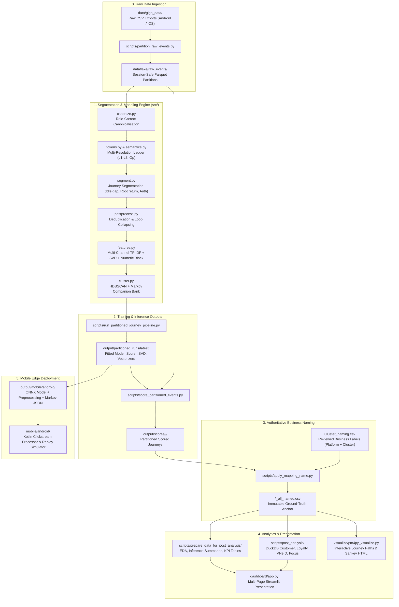
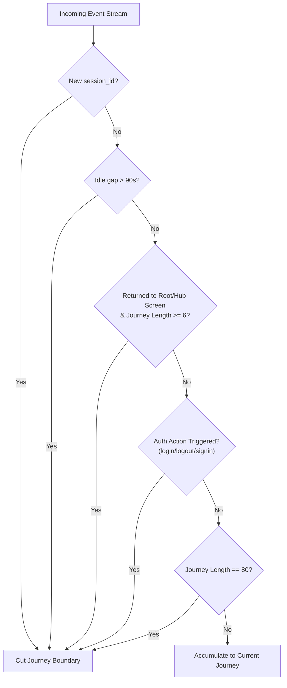
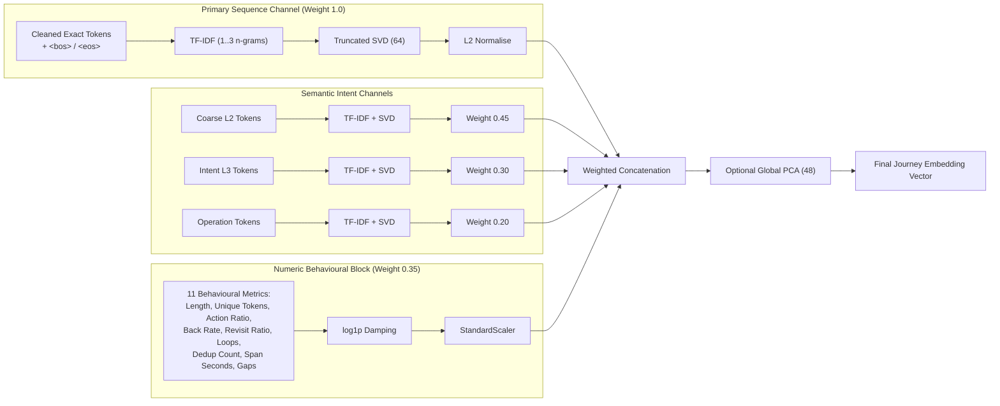
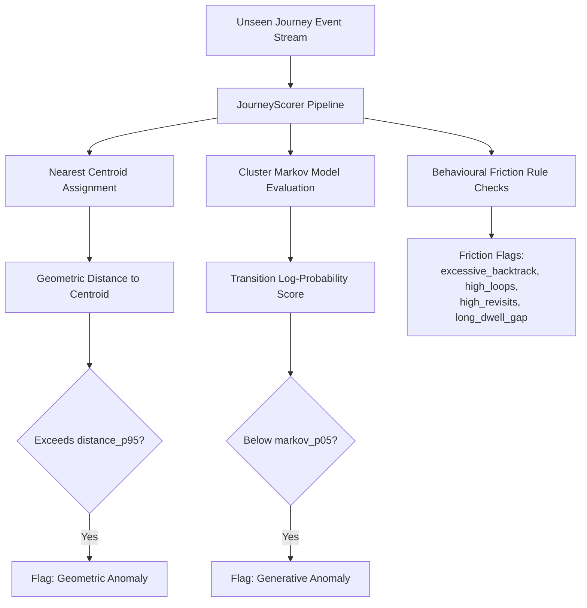

# HiFPT Journey Clustering: Unsupervised Clickstream Intelligence

> **Production-grade unsupervised journey clustering, multi-channel anomaly detection, UX friction discovery, and edge inference for high-volume mobile clickstream telemetry.**

---

## Table of Contents

- [1. Executive Overview](#1-executive-overview)
  - [The Core Problem](#the-core-problem)
  - [The Solution & Business Value](#the-solution--business-value)
  - [Key Technical Innovations](#key-technical-innovations)
- [2. End-to-End Architecture & Data Contract](#2-end-to-end-architecture--data-contract)
  - [System Flow Diagram](#system-flow-diagram)
  - [Strict Data Separation & Lifecycle Rules](#strict-data-separation--lifecycle-rules)
- [3. Core Machine Learning & Algorithmic Pipeline (`src/`)](#3-core-machine-learning--algorithmic-pipeline-src)
  - [Stage 1: Asymmetric Canonicalisation (`canonize.py`)](#stage-1-asymmetric-canonicalisation-canonizepy)
  - [Stage 2 & 3: Multi-Resolution Semantics & Tokenisation (`tokens.py`, `semantics.py`, `taxonomy.py`)](#stage-2--3-multi-resolution-semantics--tokenisation-tokenspy-semanticspy-taxonomypy)
  - [Stage 4: Journey Segmentation (`segment.py`)](#stage-4-journey-segmentation-segmentpy)
  - [Stage 5: Sequence Normalisation & Postprocessing (`postprocess.py`)](#stage-5-sequence-normalisation--postprocessing-postprocesspy)
  - [Stage 6: Multi-Channel Journey Representation (`features.py`)](#stage-6-multi-channel-journey-representation-featurespy)
  - [Stage 7: Density Clustering & Markov Companion (`cluster.py`, `prefixspan.py`)](#stage-7-density-clustering--markov-companion-clusterpy-prefixspanpy)
  - [Stage 8: Inference & Dual-Channel Anomaly Scoring (`score.py`, `hierarchical_score.py`)](#stage-8-inference--dual-channel-anomaly-scoring-scorepy-hierarchical_scorepy)
  - [Infrastructure: Out-of-Core Large Data Handling (`large_data.py`, `production.py`)](#infrastructure-out-of-core-large-data-handling-large_datapy-productionpy)
- [4. Repository Structure & Component Meaning](#4-repository-structure--component-meaning)
  - [Root Files](#root-files)
  - [`src/` — Core Engine & Machine Learning Pipeline](#src--core-engine--machine-learning-pipeline)
  - [`scripts/` — Pipeline Orchestration, ETL & Scoring](#scripts--pipeline-orchestration-etl--scoring)
  - [`scripts/post_analysis/` — Out-of-Core Customer & Business Analytics](#scriptspost_analysis--out-of-core-customer--business-analytics)
  - [`scripts/prepare_data_for_post_analysis/` — Presentation Preparation](#scriptsprepare_data_for_post_analysis--presentation-preparation)
  - [`dashboard/` — Interactive Streamlit Presentation Layer](#dashboard--interactive-streamlit-presentation-layer)
  - [`mobile/android/` — On-Device Kotlin & ONNX Clickstream Simulator](#mobileandroid--on-device-kotlin--onnx-clickstream-simulator)
  - [`docs/` — Business & Technical Documentation](#docs--business--technical-documentation)
  - [`visualize/` — Process Mining & Sankey Path Visualization](#visualize--process-mining--sankey-path-visualization)
  - [`utils/` — Data Cleaning & Event Utilities](#utils--data-cleaning--event-utilities)
  - [`tests/` — Automated Test Suite](#tests--automated-test-suite)
  - [`notebooks/` — Exploratory Data Analysis & Prototyping](#notebooks--exploratory-data-analysis--prototyping)
  - [`data/` & `output/` — Lake & Artifact Storage Layout](#data--output--lake--artifact-storage-layout)
- [5. Step-by-Step Execution Guide](#5-step-by-step-execution-guide)
  - [0. Installation & Prerequisites](#0-installation--prerequisites)
  - [1. Partition Large Raw Clickstream CSVs](#1-partition-large-raw-clickstream-csvs)
  - [2. Train Models & Evaluate Holdout](#2-train-models--evaluate-holdout)
  - [3. Batch Score Full-Data or Run Smoke Tests](#3-batch-score-full-data-or-run-smoke-tests)
  - [4. Apply Authoritative Business Naming Mapping](#4-apply-authoritative-business-naming-mapping)
  - [5. Run Independent Customer & Business Post-Analyses](#5-run-independent-customer--business-post-analyses)
  - [6. Prepare Presentation Summaries & Launch Streamlit Dashboard](#6-prepare-presentation-summaries--launch-streamlit-dashboard)
  - [7. Generate Interactive Process Flow & Sankey Diagrams](#7-generate-interactive-process-flow--sankey-diagrams)
  - [8. Deploy & Simulate On-Device Mobile Inference (Android)](#8-deploy--simulate-on-device-mobile-inference-android)
- [6. Data Contracts & Output Schemas](#6-data-contracts--output-schemas)
- [7. Core Design Philosophy & Engineering Principles](#7-core-design-philosophy--engineering-principles)

---

## 1. Executive Overview

### The Core Problem

Modern mobile applications such as HiFPT capture massive volumes of raw clickstream logs: every screen view, tab switch, and button click produces a telemetry record. Over millions of events across hundreds of thousands of users, this telemetry presents significant challenges:

1. **Unstructured Stream Noise**: Clickstream logs are continuous, flat, and noisy. They do not naturally delineate where a user's task begins or ends.
2. **Asymmetric Event Schemas**: Depending on whether an event is a `View` or an `Action`, screen and target identifiers appear in different columns (`segment_name` vs `screen_name`), causing disjoint vocabularies.
3. **Cross-Platform Discrepancies**: iOS and Android use completely different screen identifiers for the same business feature (e.g., `FsListConnectedDeviceVC` on iOS vs `internet_fprotect_screen/management_device/management_device_screen` on Android).
4. **Distorted Session Definitions**: Technical `session_id`s in clickstream data can span up to 30+ hours and contain thousands of mixed, unrelated user tasks.
5. **Lack of Ground-Truth Labels**: Manual labeling of millions of user sessions is economically and operationally impossible.

### The Solution & Business Value

**HiFPT Journey Clustering** is an end-to-end, unsupervised machine learning framework that automatically parses, segments, vectorises, clusters, and names user clickstreams into discrete, semantically meaningful **User Journeys**.

```
... 47 raw, unstructured log records ...
                ↓
"Customer is paying postpaid bill via VNPay"
"Customer is performing guest OTP authentication"
"Customer is upgrading Internet package (Experiencing UX friction / backtracking)"
```

| Business Capability | Operational Impact |
|---|---|
| **Automated Intent Discovery** | Identifies what users set out to accomplish without requiring pre-labeled training data. |
| **Cross-Platform Parity** | Multi-resolution semantic ladders bridge iOS and Android naming into unified behavioral concepts. |
| **Dual-Channel Anomaly Detection** | Combines geometric outlier detection (distance to cluster centroid) with generative sequence likelihoods (Markov transition chains) to catch abnormal user flows. |
| **Proactive Friction Detection** | Quantifies UX struggle (backtracking rate, cyclic loops, revisit ratios, dwell gaps) to pinpoint UI bottlenecks. |
| **Next-Action Prediction** | Uses fitted transition probability matrices to forecast the user's next step for proactive support or smart nudges. |
| **Edge-Ready Inference** | Deploys on-device via ONNX Runtime and Kotlin for zero-latency, privacy-preserving real-time journey classification. |

### Key Technical Innovations

- **Role-Correct Canonicalisation**: Dynamically aligns column meanings between `View` and `Action` events while masking volatile dynamic parameters (IDs, UUIDs, hex tokens, contract codes, non-semantic query strings).
- **Multi-Resolution Semantic Ladder**: Employs 5 resolution levels (`Exact`, `L3 Intent`, `L2 Coarse`, `L1 Family`, `Operation Stage`) so cross-platform equivalents align in embedding space.
- **Rule & Entropy-Based Boundary Detection**: Combines domain rules ($\tau = 90$s idle gap, root screen return, login/logout events, length caps) with optional statistical branching entropy $H(\text{next} \mid \text{context})$ to segment raw sessions into cohesive journeys.
- **Multi-Channel Hybrid Representation**: Fuses sequence $n$-gram TF-IDF + Truncated SVD with semantic channel SVDs and an 11-metric numeric behavioral block.
- **Density-Based Archetype Learning**: Uses HDBSCAN to identify natural journey shapes without forcing arbitrary $k$ clusters, explicitly isolating noise/outliers into cluster `-1`.
- **Out-of-Core Scalability**: Built with PyArrow and DuckDB to process multi-gigabyte clickstream datasets with bounded memory usage and automatic disk spilling.

---

## 2. End-to-End Architecture & Data Contract

### System Flow Diagram



### Strict Data Separation & Lifecycle Rules

The codebase enforces strict isolation between raw data, fitted model artifacts, scoring partitions, business naming, and downstream analytical consumers:

1. **The Model Unit is One Journey Row**: Models and scorers operate on individual segmented journeys, never on raw events directly or aggregated customer records.
2. **The Analytics Unit is `customer_id`**: Customer retention, footprint, churn, and loyalty metrics aggregate journeys by customer identifier.
3. **Immutable Analytical Anchor (`*_all_named.csv`)**: Downstream post-analyses must **only** read the authoritative `*_all_named.csv` generated by joining scored journeys with the human/LLM-reviewed `Cluster_naming.csv`. Raw event lake partitions or unnamed score partitions are never used for shareholder KPIs.
4. **Decoupled Dashboard Presentation**: The Streamlit dashboard (`dashboard/app.py`) **never** performs full-table multi-gigabyte scans on launch. It strictly consumes pre-computed summary tables (`html_dashboard_summary/`, `shareholder_analysis/`, and bounded audit samples).
5. **No Synthetic Counts**: EDA statistics are calculated from actual raw event profiling (`eda_raw.py`), never approximated from Parquet metadata footers.

---

## 3. Core Machine Learning & Algorithmic Pipeline (`src/`)

### Stage 1: Asymmetric Canonicalisation ([`src/canonize.py`](file:///Users/hoangnguyen/Desktop/hifpt-journey/Unsupervised-Journey-Clustering/src/canonize.py))

Clickstream logging formats frequently invert column meanings depending on the event type:
- When `event_type == "View"`: `segment_name` contains the screen name, while `screen_name` is `NULL`.
- When `event_type == "Action"`: `screen_name` contains the screen name, while `segment_name` contains the action path within that screen (e.g., `Home/Nav_profile`).

If concatenated naively, `View` and `Action` events reside in disjoint token spaces. `canonize.py` resolves this into a role-correct triple `(event_type, screen, target)`:
- **OS Namespacing**: Screens are namespaced by OS (e.g., `Android::android/Home` vs `iOS::HomeVC`) preventing false token collisions.
- **Dynamic Parameter Masking**: Replaces runtime instance IDs with type placeholders:
  - Digits $\to$ `{id}`
  - UUIDs / 24-hex hashes $\to$ `{uuid}`
  - Contract / Order codes (e.g., `SGABP2073`, `HNIJH0026HQV`) $\to$ `{code}`
- **URL Parameter Filtering**: Webview URLs retain only semantic parameters defined in `SEMANTIC_QUERY_KEYS` (`tab`, `step`, `type`, `mode`, `status`, `view`, `cat_id`) while stripping instance identifiers (`contractNo`, `orderId`, `utm_*`, `timestamp`).

---

### Stage 2 & 3: Multi-Resolution Semantics & Tokenisation ([`src/tokens.py`](file:///Users/hoangnguyen/Desktop/hifpt-journey/Unsupervised-Journey-Clustering/src/tokens.py), [`src/semantics.py`](file:///Users/hoangnguyen/Desktop/hifpt-journey/Unsupervised-Journey-Clustering/src/semantics.py), [`src/taxonomy.py`](file:///Users/hoangnguyen/Desktop/hifpt-journey/Unsupervised-Journey-Clustering/src/taxonomy.py))

A single user action is mapped across a 5-level semantic ladder:

| Level | Representation Example | Meaning / Granularity |
|---|---|---|
| **Exact** | `action@ManageModemVC#do_action/MODEM_TURN_ON_OFF` | Verbatim event token (high precision, high variance) |
| **L3 Intent** | `internet/modem/modem/toggle` | `family / module / object / operation` |
| **L2 Coarse** | `internet/modem` | `family / module` |
| **L1 Family** | `internet` | High-level business domain |
| **Operation** | `configure:toggle` | `stage : operation` |

- **Semantic Enrichment**: Structural path rules map disparate OS implementations (e.g., iOS `FsListConnectedDeviceVC` and Android `internet_fprotect_screen/management_device`) to the exact same coarse token `internet/device`.
- **Rare-Token Backoff**: Tokens appearing in fewer than `min_journey_df = 3` journeys automatically degrade to their coarser semantic form ($L3 \to L2 \to L1 \to \text{<rare>}$), eliminating the singleton long tail without discarding user activity.

---

### Stage 4: Journey Segmentation ([`src/segment.py`](file:///Users/hoangnguyen/Desktop/hifpt-journey/Unsupervised-Journey-Clustering/src/segment.py))

Raw telemetry `session_id`s do not represent single user goals (spans reach 30+ hours). `segment.py` divides sessions into cohesive journeys using two complementary methodologies:



1. **L0 Rule-Based Segmentation (Deterministic Production Baseline)**:
   - **Session Change**: Transition to a new `session_id`.
   - **Idle Inactivity Gap**: Inter-event duration $\Delta t > 90$s ($\tau = 90$s corresponds to empirical $p97.5$ pause threshold).
   - **Root / Hub Return**: User returns to a main navigation hub (`HomeVC`, `HOME`, `HomeGuestVC`) after at least $k = 6$ intermediate actions.
   - **Auth State Transition**: Explicit login/logout action targets (`continue_login`, `sign_out`, `signin_success`).
   - **Hard Length Cap**: Caps journeys at 80 events to prevent unbounded accumulation.
2. **L1 Branching Entropy (Statistical Refinement, Opt-in)**:
   - Computes context conditional entropy $H(\text{next} \mid \text{context}) = -\sum p \log p$. Within a single task flow, screen transitions are highly predictable (low entropy); at goal boundaries, choice branching spikes (high entropy). Cuts are made when entropy crosses a calibrated percentile threshold.

---

### Stage 5: Sequence Normalisation & Postprocessing ([`src/postprocess.py`](file:///Users/hoangnguyen/Desktop/hifpt-journey/Unsupervised-Journey-Clustering/src/postprocess.py))

Before vectorisation, sequence noise is reduced while retaining behavioural signals:
- **Consecutive Deduplication**: Collapses repeated taps on identical tokens (e.g., $A \to A \to A \to A$), recording the count in `n_dedup_removed`.
- **Cyclic Loop Detection**: Detects periodic ping-pong loops (e.g., $A \to B \to A \to B$) for periods $p \in [2, 4]$, collapsing them while recording `n_loop_removed`.
- **Screen Filtering Policies**: Configurable removal of OS container chrome (`drop_chrome`) and launch splash screens (`drop_boot`).

---

### Stage 6: Multi-Channel Journey Representation ([`src/features.py`](file:///Users/hoangnguyen/Desktop/hifpt-journey/Unsupervised-Journey-Clustering/src/features.py))

Journeys are converted into a rich vector space fusing sequence order, semantic intent, and behavioural metrics:



- **Boundary Sentinels**: Injects `<bos>` (beginning-of-sequence) and `<eos>` (end-of-sequence) tokens so journey entry and exit points become explicit discriminative features.
- **Log1p Damped Behavioural Metrics**: Features with skewed distributions (`span_seconds`, `n_loop_removed`, `median_gap_s`) are $\log(1+x)$ transformed before standard scaling.
- **Strict $L_2$ Normalisation**: Every block is $L_2$-normalised prior to weighting so vocabulary sizes and SVD ranks cannot artificially dominate Euclidean distance.

---

### Stage 7: Density Clustering & Markov Companion ([`src/cluster.py`](file:///Users/hoangnguyen/Desktop/hifpt-journey/Unsupervised-Journey-Clustering/src/cluster.py), [`src/prefixspan.py`](file:///Users/hoangnguyen/Desktop/hifpt-journey/Unsupervised-Journey-Clustering/src/prefixspan.py))

Two companion models are fitted to answer distinct analytical questions:

1. **HDBSCAN Density Clustering ("What journey archetypes exist?")**:
   - Discovers clusters of arbitrary geometric shape without enforcing an arbitrary $k$.
   - **Explicit Noise Labeling**: Assigns irregular, unstructured journeys to cluster `-1` (Noise) rather than forcing them into artificial centroids.
   - Internal validation indices: Silhouette Score, Davies-Bouldin Index, Calinski-Harabasz Index.
   - Baseline validation: Sweeps $k$-Means across a $k \in [6, 30]$ grid to verify cluster boundaries.
2. **Cluster-Specific Markov Chain Bank ("How typical is this journey within its archetype?")**:
   - Fits a first-order smoothed Markov transition matrix for each discovered cluster, plus a global background chain:
     $$P(t_i \mid t_{i-1}) = \frac{C(t_{i-1}, t_i) + \alpha}{\sum_v (C(t_{i-1}, v) + \alpha)}$$
   - Computes sequence log-likelihood:
     $$\log \mathcal{L}(S) = \sum_{i=1}^{|S|-1} \log P(t_{i+1} \mid t_i)$$
   - Provides calibrated anomaly scoring and next-action transition forecasts.
3. **PrefixSpan Pattern Mining (Route B Sequential Discovery)**:
   - Mines frequent closed sequential action patterns across journeys with support pruning, extracting deterministic sub-path patterns.

---

### Stage 8: Inference & Dual-Channel Anomaly Scoring ([`src/score.py`](file:///Users/hoangnguyen/Desktop/hifpt-journey/Unsupervised-Journey-Clustering/src/score.py), [`src/hierarchical_score.py`](file:///Users/hoangnguyen/Desktop/hifpt-journey/Unsupervised-Journey-Clustering/src/hierarchical_score.py))

The `JourneyScorer` scores new journeys across multiple independent dimensions:



- **Geometric Anomaly**: Journey falls outside the 95th percentile distance to its cluster centroid (unusual overall journey structure).
- **Generative Anomaly**: Sequence exhibits low Markov transition log-probability (unusual internal screen transition sequence).
- **UX Friction Flags**: Automated rule checks for high backtracking (`back_rate > p90`), excessive loops (`n_loop_removed > p90`), high revisit ratio (`revisit_ratio > p90`), or excessive duration (`span_seconds > p95`).

---

### Infrastructure: Out-of-Core Large Data Handling ([`src/large_data.py`](file:///Users/hoangnguyen/Desktop/hifpt-journey/Unsupervised-Journey-Clustering/src/large_data.py), [`src/production.py`](file:///Users/hoangnguyen/Desktop/hifpt-journey/Unsupervised-Journey-Clustering/src/production.py))

- **Session-Safe Partitioning**: Uses deterministic hashing `stable_session_bucket(platform, session_id)` ensuring that events belonging to the same session are **never split across partition boundaries**.
- **Chronological Holdout Split**: Partitions whole sessions chronologically into train ($80\%$) and holdout ($20\%$) sets, guaranteeing zero data leakage across train/test splits.
- **Bounded Memory Streaming**: Employs PyArrow Parquet streaming and chunked readers, allowing multi-gigabyte datasets (e.g. 6M+ rows) to execute reliably on standard workstations.

---

## 4. Repository Structure & Component Meaning

```text
Unsupervised-Journey-Clustering/
├── dashboard/                  # Streamlit multi-page analytics presentation application
│   ├── app.py                  # Main entry point and page router
│   ├── lib.py                  # Caching, metric computation, chart formatting utilities
│   ├── prepare_dashboard_data.py # Out-of-core data extractor for fast dashboard loading
│   ├── README.md               # Dashboard data source contracts & documentation
│   └── views/                  # Dedicated dashboard view modules
│       ├── page_overview.py    # Executive overview, headline KPIs & platform comparison
│       ├── page_eda.py         # Raw clickstream EDA & event profiling
│       ├── page_training.py    # Training hyperparameters, SVD variance & validation
│       ├── page_clusters.py    # Learned journey catalog, signatures & Markov graphs
│       ├── page_inference.py   # Production inference distribution & anomaly explorer
│       └── page_customer_based.py # Customer-level footprint, journeys & focus deep-dives
│
├── data/                       # Clickstream data repository
│   ├── giga_data/              # Raw multi-gigabyte Android/iOS CSV log exports
│   ├── lake/                   # Session-safe Parquet data lake
│   │   ├── raw_events/         # Partitioned raw events (partition_raw_events.py)
│   │   └── journeys/           # Pre-materialised partitioned journey datasets
│   └── production_data/        # Reference/sample production datasets
│
├── docs/                       # Comprehensive project documentation
│   ├── 0_Solution_For_Stakeholders.md # Non-technical executive summary & methodology
│   ├── 1_Data_Exploration.md   # Initial clickstream data exploration findings
│   ├── 2_Session_Based_EDA.md  # Session length & duration analysis
│   ├── 3_Exact_Tokenization_and_Sequences.md # Token ladder & vocabulary audit
│   ├── 4_Clustering_Two_Routes.md # Route A (HDBSCAN) vs Route B (PrefixSpan)
│   ├── 5_Cluster_Names.md      # Cluster profiles, naming & representative traces
│   ├── 6_Android_Cluster_Class_Mapping.md # Android cluster-to-business class mappings
│   ├── 7_Cluster_Noise_Postprocessing.md # Noise assignment & recovery strategies
│   ├── 8_Reusable_Cluster_Naming_Prompt.md # LLM prompting templates for cluster naming
│   ├── 9_Semantic_Enrichment.md # Domain taxonomy & semantic parser rules
│   ├── 10_Large_Data_Processing_and_Continuous_Learning_Plan.md # Big data scaling plan
│   ├── 11_Inference_Result_Column_Metadata.md # Column-level schema specifications
│   ├── Data_Exploration_and_Tokenization.md # Technical tokenization guide
│   └── Journey_Approach_Validation.md # Methodological validation report
│
├── mobile/                     # Mobile on-device edge AI integration
│   └── android/                # Native Android Studio clickstream simulator & edge runner
│       ├── app/                # Android application module (Kotlin + ONNX Runtime)
│       │   └── src/main/assets/ # Deployed ONNX model, Markov JSON & preprocessing assets
│       ├── JourneyOnnxClassifier.kt # Kotlin ONNX wrapper & journey classifier
│       └── README.md           # Android bundle deployment & simulator instructions
│
├── notebooks/                  # Interactive exploratory Jupyter notebooks
│   ├── 1_data_exploration.ipynb # Initial data parsing & column exploration
│   ├── 2_session_based_eda.ipynb # Session boundaries & duration distributions
│   ├── 3_Tokenization.ipynb    # Multi-resolution tokenization experiments
│   ├── 4_explore_result.ipynb  # Clustering result analysis & visualizations
│   ├── 5_edit_data.ipynb       # Data transformation scratchpad
│   ├── clean_data.ipynb        # Data cleansing workflows
│   └── eda.ipynb               # End-to-end exploratory data analysis
│
├── output/                     # Generated artifacts, models, scores & analyses
│   ├── partitioned_runs/       # Trained model runs by platform (latest/android, latest/ios)
│   ├── scores/                 # Partitioned scoring outputs & shareholder analyses
│   │   └── <bundle_name>/      # Bundle root containing named anchors & post-analyses
│   ├── dashboard_cache/        # Cached summary datasets for Streamlit
│   └── mobile/                 # Exported ONNX models, JSON configs & manifests
│
├── scripts/                    # CLI execution entrypoints & pipeline orchestrators
│   ├── partition_raw_events.py # Chunks raw CSVs into session-safe Parquet partitions
│   ├── run_partitioned_journey_pipeline.py # Trains and validates platform models
│   ├── score_partitioned_events.py # High-throughput batch scoring on full data
│   ├── apply_mapping_name.py   # Joins business naming to produce immutable anchors
│   ├── build_cluster_naming.py # Extracts cluster profiles for LLM/expert naming
│   ├── build_cluster_business_mapping.py # Builds cluster-to-business mappings
│   ├── build_cluster_mapping_csv.py # Compiles human-readable naming CSVs
│   ├── build_customer_journey_sequences.py # Builds customer journey path sequences
│   ├── build_inference_html_dashboard.py # Generates standalone HTML dashboards
│   ├── build_platform_cluster_business_mappings.py # Multi-platform mapping builder
│   ├── extract_inference_dashboard_summaries.py # DuckDB summary metric extractor
│   ├── postprocess_cluster_runs.py # Cluster noise refinement & postprocessing
│   ├── apply_cluster_business.py # Applies business taxonomy to scored runs
│   │
│   ├── post_analysis/          # Independent DuckDB customer/business post-analyses
│   │   ├── common.py           # Reusable DuckDB session setup & query helpers
│   │   ├── analyze_customer_metrics.py # Customer footprint, monthly activity & journey mix
│   │   ├── analyze_focus_journeys.py # Deep dives into VNeID, Support, Payment, Device
│   │   ├── analyze_post_vneid_econtract.py # E-Contract & VNeID post-signing behavior
│   │   ├── analyze_loyalty.py  # Loyalty cohort analysis & downstream impact
│   │   ├── run_all.py          # Orchestrator for all post-analysis jobs
│   │   └── README.md           # Post-analysis architecture & documentation
│   │
│   └── prepare_data_for_post_analysis/ # Presentation preparation layer
│       ├── eda_raw.py          # Profiles raw CSVs and outputs eda_summary.json
│       ├── train_output.py     # Extracts metadata from training runs
│       ├── inference_summary.py # Canonical out-of-core DuckDB inference summarizer
│       ├── html_dashboard.py   # Static HTML dashboard generator
│       ├── build_all.py        # All-in-one preparation orchestrator
│       └── README.md           # Data preparation contracts & guidelines
│
├── src/                        # Core algorithmic package (Re-usable library)
│   ├── __init__.py             # Package declaration
│   ├── config.py               # Central dataclass configuration (Pipeline, Features, Cluster)
│   ├── canonize.py             # Role-correct event canonicalisation & parameter masking
│   ├── tokens.py               # Multi-resolution token ladder & rare-token backoff
│   ├── semantics.py            # Structural path parsing into family/module/intent
│   ├── taxonomy.py             # Business taxonomy definitions & screen classifications
│   ├── segment.py              # Journey segmentation (L0 rules & L1 branching entropy)
│   ├── postprocess.py          # Consecutive deduplication & cycle/loop collapsing
│   ├── features.py             # Multi-channel TF-IDF + Truncated SVD vectorizer
│   ├── cluster.py              # HDBSCAN clustering, Markov companion bank & quality metrics
│   ├── prefixspan.py           # PrefixSpan sequential pattern mining implementation
│   ├── score.py                # JourneyScorer inference engine & anomaly thresholds
│   ├── hierarchical_score.py   # Multi-tier hierarchical scoring & cluster refinement
│   ├── large_data.py           # Parquet I/O, session-safe hashing & dataset loaders
│   ├── production.py           # Production schema adapter & streaming journey boundaries
│   ├── cluster_mapping.py      # Business mapping data structures & naming resolvers
│   ├── cluster_postprocess.py  # Post-cluster noise reassignment & refinement logic
│   ├── experiment.py           # Parameter sweep & clustering experiment runners
│   └── timing.py               # Execution time measurement context managers
│
├── tests/                      # Unit, integration, and parity test suite
│   ├── test_apply_cluster_business.py # Tests for business mapping application
│   ├── test_build_cluster_mapping_csv.py # Tests for CSV mapping builders
│   ├── test_cluster_mapping.py # Tests for cluster mapping resolvers
│   ├── test_cluster_postprocess.py # Tests for noise postprocessing
│   ├── test_hierarchical_score.py # Tests for hierarchical scoring engine
│   ├── test_large_data.py      # Tests for Parquet partitioning & session bucketing
│   ├── test_production_pipeline.py # Tests for production schema adapters
│   ├── test_reasoned_cluster_naming_pipeline.py # Tests for naming pipelines
│   ├── test_run_journey_pipeline.py # Integration test for end-to-end pipeline
│   ├── test_semantics.py       # Tests for semantic annotation & taxonomy rules
│   └── test_tokens_and_features.py # Tests for tokenization, SVD & feature vectorizers
│
├── utils/                      # Data cleansing & raw log conversion utilities
│   ├── clean_data.py           # Data normalization & cleanup functions
│   ├── exact_event_analysis.py # Detailed event log exploration & vocabulary auditing
│   └── json_to_csv.py          # Utilities to convert Extended JSON MongoDB dumps to CSV
│
├── visualize/                  # Process mining & interactive path visualization
│   └── pm4py_visualize.py      # Generates interactive multi-level Sankey & journey HTML
│
├── requirements.txt            # Core Python dependencies
├── requirements-onnx.txt       # ONNX export & runtime dependencies
├── loyalty.json                # Loyalty analysis metadata & schema specification
└── README.md                   # Comprehensive project documentation (this file)
```

---

## 5. Step-by-Step Execution Guide

### 0. Installation & Prerequisites

Ensure Python 3.10+ is installed. Clone the repository and install dependencies:

```bash
# Clone the repository
git clone https://github.com/HNg0303/Unsupervised-Journey-Clustering.git
cd Unsupervised-Journey-Clustering

# Create and activate a virtual environment
python3 -m venv .venv
source .venv/bin/activate

# Install core dependencies (PyArrow, DuckDB, scikit-learn, Streamlit, etc.)
pip install -r requirements.txt

# (Optional) Install ONNX dependencies for edge export
pip install -r requirements-onnx.txt
```

---

### 1. Partition Large Raw Clickstream CSVs

Large raw CSV log exports in `data/giga_data/` should be partitioned into session-safe Parquet files. This reads CSVs in chunks and guarantees that all events for a given session reside in the same partition:

```bash
python scripts/partition_raw_events.py \
  --input-root data/giga_data \
  --output-root data/lake/raw_events \
  --chunk-size 200000 \
  --partitions-per-platform 16
```

---

### 2. Train Models & Evaluate Holdout

Fit the vectorizers, Truncated SVD, HDBSCAN clusterer, and Markov companion chains per platform using partitioned data:

```bash
python scripts/run_partitioned_journey_pipeline.py \
  --input data/lake/raw_events \
  --journeys-root data/lake/journeys \
  --output-root output/partitioned_runs \
  --run-name latest \
  --mode all \
  --max-training-journeys 500000 \
  --test-size 0.2 \
  --min-cluster-size 100 \
  --min-samples 5 \
  --svd-components 48 \
  --global-pca 48 \
  --idle-gap 90.0
```

*Outputs written to `output/partitioned_runs/latest/{android,ios}/`:*
- `journey_scorer.pkl`: Complete fitted `JourneyScorer` object.
- `vectorizer.pkl`: Multi-channel TF-IDF and SVD vectorizer.
- `cluster_catalog.csv`: Cluster statistics, centroids, and top representative sequences.
- `cluster_mapping.json`: Cluster ID to business mapping skeleton.
- `holdout_evaluation.json`: Validation metrics on unseen holdout sessions.

---

### 3. Batch Score Full-Data or Run Smoke Tests

Score millions of raw events or a single CSV smoke test using the trained model:

```bash
# Full dataset batch scoring (Partitioned Parquet)
python scripts/score_partitioned_events.py \
  --input data/lake/raw_events \
  --platform android \
  --single-run output/partitioned_runs/latest/android \
  --output-root output/scores/pca48_ngrams12_500

# Direct CSV Smoke Test (Exports scored Parquet/CSV directly)
python scripts/score_partitioned_events.py \
  --input data/giga_data/android_events_t3-2026.csv \
  --platform android \
  --single-run output/partitioned_runs/latest/android \
  --output-root output/scores/pca48_ngrams12_500 \
  --parquet
```

---

### 4. Apply Authoritative Business Naming Mapping

Join the human/LLM-reviewed `Cluster_naming.csv` with the scored partition outputs to create the immutable `*_all_named.csv` analytical anchors:

```bash
# Android Named Anchor
python scripts/apply_mapping_name.py \
  --input output/scores/pca48_ngrams12_500/android/model_version=latest/platform=android \
  --platform android \
  --mapping output/scores/pca48_ngrams12_500/Cluster_naming.csv \
  --output output/scores/pca48_ngrams12_500/shareholder_analysis/android_all_named.csv

# iOS Named Anchor
python scripts/apply_mapping_name.py \
  --input output/scores/pca48_ngrams12_500/ios/model_version=latest/platform=ios \
  --platform ios \
  --mapping output/scores/pca48_ngrams12_500/Cluster_naming.csv \
  --output output/scores/pca48_ngrams12_500/shareholder_analysis/ios_all_named.csv
```

---

### 5. Run Independent Customer & Business Post-Analyses

Execute out-of-core DuckDB customer and business analysis scripts against the named anchors:

```bash
# Run all post-analyses at once
python scripts/post_analysis/run_all.py \
  --android output/scores/pca48_ngrams12_500/shareholder_analysis/android_all_named.csv \
  --ios output/scores/pca48_ngrams12_500/shareholder_analysis/ios_all_named.csv \
  --output-dir output/scores/pca48_ngrams12_500/shareholder_analysis

# Or run individual modules independently:
# 1. Customer Footprint & Journey Mix
python scripts/post_analysis/analyze_customer_metrics.py \
  --android output/scores/pca48_ngrams12_500/shareholder_analysis/android_all_named.csv \
  --ios output/scores/pca48_ngrams12_500/shareholder_analysis/ios_all_named.csv \
  --output-dir output/scores/pca48_ngrams12_500/shareholder_analysis

# 2. Focus Journeys Deep Dive (VNeID, Support, Payment, Device, Notifications)
python scripts/post_analysis/analyze_focus_journeys.py \
  --android output/scores/pca48_ngrams12_500/shareholder_analysis/android_all_named.csv \
  --ios output/scores/pca48_ngrams12_500/shareholder_analysis/ios_all_named.csv \
  --output-dir output/scores/pca48_ngrams12_500/shareholder_analysis

# 3. Loyalty Cohort & Downstream Actions
python scripts/post_analysis/analyze_loyalty.py \
  --android output/scores/pca48_ngrams12_500/shareholder_analysis/android_all_named.csv \
  --ios output/scores/pca48_ngrams12_500/shareholder_analysis/ios_all_named.csv \
  --output-dir output/scores/pca48_ngrams12_500/shareholder_analysis

# 4. Post-VNeID & E-Contract Signing Behavior
python scripts/post_analysis/analyze_post_vneid_econtract.py \
  --input output/scores/pca48_ngrams12_500/shareholder_analysis/android_all_named.csv \
  --output-dir output/scores/pca48_ngrams12_500/shareholder_analysis
```

---

### 6. Prepare Presentation Summaries & Launch Streamlit Dashboard

Extract compact summary tables for the UI layer and start the interactive Streamlit dashboard:

```bash
# 1. Extract raw event EDA metrics
python scripts/prepare_data_for_post_analysis/eda_raw.py \
  --input-root data/giga_data \
  --output-dir output/scores/pca48_ngrams12_500/post_analysis/eda

# 2. Extract full inference summary aggregates
python scripts/prepare_data_for_post_analysis/inference_summary.py \
  --android output/scores/pca48_ngrams12_500/shareholder_analysis/android_all_named.csv \
  --ios output/scores/pca48_ngrams12_500/shareholder_analysis/ios_all_named.csv \
  --naming output/scores/pca48_ngrams12_500/Cluster_naming.csv \
  --output-dir output/scores/pca48_ngrams12_500/html_dashboard_summary

# 3. Register and cache dashboard data
python dashboard/prepare_dashboard_data.py

# 4. Launch the Streamlit web application
streamlit run dashboard/app.py
```

*The dashboard will be accessible at `http://localhost:8501`.*

---

### 7. Generate Interactive Process Flow & Sankey Diagrams

Build chronological customer journey sequences and render interactive, browser-based Sankey path HTML reports:

```bash
# 1. Build customer journey sequences
python scripts/build_customer_journey_sequences.py \
  --android output/scores/pca48_ngrams12_500/shareholder_analysis/android_all_named.csv \
  --ios output/scores/pca48_ngrams12_500/shareholder_analysis/ios_all_named.csv \
  --output-dir output/scores/pca48_ngrams12_500/customer_journey_sequences \
  --top-sessions 200

# 2. Generate interactive visual HTML
python visualize/pm4py_visualize.py \
  --input output/scores/pca48_ngrams12_500/customer_journey_sequences/journey_path_detail.csv \
  --output output/scores/pca48_ngrams12_500/customer_journey_sequences/journey_paths.html \
  --level business_submodule
```

---

### 8. Deploy & Simulate On-Device Mobile Inference (Android)

The repository provides a complete Android Studio clickstream simulator and Kotlin edge inference runner in `mobile/android/`:

1. Open `mobile/android` in **Android Studio**.
2. Synchronize Gradle with project files (`com.microsoft.onnxruntime:onnxruntime-android:1.20.0`).
3. Deploy the exported bundle assets into `app/src/main/assets/`:
   - `journey_classifier.onnx`
   - `preprocessing.json`
   - `class_mapping.json`
   - `markov.json`
   - `friction_config.json`
   - `manifest.json`
4. Run the application on an Android emulator (API 26+) to simulate live clickstream playback at variable speeds (`0.25x` to `10x`) with real-time on-device classification, friction detection, and next-action prediction.

---

## 6. Data Contracts & Output Schemas

Every scored journey produced by `JourneyScorer` conforms to a standardized schema. Detailed below are the primary field groups (refer to [`docs/11_Inference_Result_Column_Metadata.md`](file:///Users/hoangnguyen/Desktop/hifpt-journey/Unsupervised-Journey-Clustering/docs/11_Inference_Result_Column_Metadata.md) for full column metadata):

| Group | Key Columns | Description |
|---|---|---|
| **Identity & Provenance** | `journey_id`, `session_id`, `customer_id`, `platform`, `start_ts`, `end_ts`, `model_version`, `source_partition` | Unique identifiers, timestamps, session links, and model lineage. |
| **Segmentation Metrics** | `boundary_reason`, `n_events_raw`, `n_events_final`, `n_unique_tokens`, `n_dedup_removed`, `n_loop_removed` | Trigger reason for journey cut (`idle_gap`, `root_return`, `auth_change`) and event filtering counts. |
| **Behavioural Metrics** | `action_ratio`, `back_rate`, `revisit_ratio`, `span_seconds`, `median_gap_s`, `p90_gap_s`, `max_gap_s` | Quantified user interaction characteristics and timing dynamics. |
| **Journey Archetype** | `cluster`, `cluster_name`, `business_family`, `business_submodule`, `class_code` | Assigned cluster ID, Vietnamese business name, and taxonomy classification. |
| **Anomaly & Scoring** | `centroid_distance`, `markov_logprob`, `is_anomaly_geom`, `is_anomaly_markov`, `anomaly_score` | Distance to cluster center, Markov transition likelihood, and boolean anomaly flags. |
| **UX Friction Signals** | `friction_flags` | String of detected friction signals (`excessive_backtrack`, `high_loops`, `high_revisits`, `long_dwell_gap`). |
| **Next Action & Path** | `next_action`, `sequence`, `first_token`, `last_token` | Predicted next user action and clean ordered token transition sequence. |

---

## 7. Core Design Philosophy & Engineering Principles

1. **Unsupervised First, Human Labeling Second**:
   Algorithms discover the underlying natural cluster structure from mathematical representations. Domain experts and LLMs only assign meaningful business names to discovered clusters.
2. **Out-of-Core by Default**:
   All pipeline steps (ETL, training, scoring, post-analysis) are designed to stream data via PyArrow and DuckDB. Large multi-gigabyte datasets process with constant, bounded memory envelopes.
3. **Decoupled Architecture**:
   Raw event logs, trained models, batch inference outputs, business mappings, and presentation layers are strictly isolated. Any layer can be re-run or updated without triggering end-to-end recomputation.
4. **Reproducibility & Traceability**:
   Pipeline parameters are centralized in dataclasses (`src/config.py`). Scored rows retain their `model_version` and `source_partition` provenance.
5. **Production & Edge Parity**:
   The Python feature extraction pipeline and the Kotlin Android mobile runner share identical tokenization rules, parameter masking algorithms, and model formats (ONNX + JSON contracts).

---

## License

This project is licensed under the Apache License 2.0. See the [LICENSE](LICENSE) file for details.
