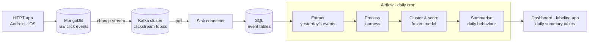
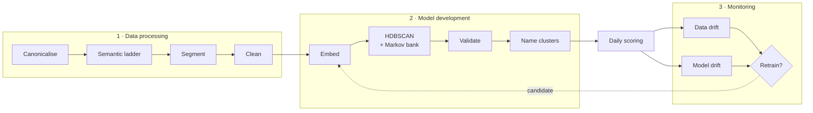

# HiFPT Journey Clustering

**Unsupervised discovery of user journeys from large-scale mobile clickstream telemetry.**

The project has two halves:

- **Data pipeline.** App events flow from MongoDB through Kafka into SQL. A custom sink
  connector pulls them from Kafka, and an Airflow cron job runs every day to summarise and
  cluster user behaviour.
- **ML pipeline.** Data processing, then model development, then monitoring for data and
  model drift. It turns raw clicks into named, scored user journeys without any labels.

```text
... 47 raw, unlabeled log records ...
                 ↓
"Paying postpaid bill via VNPay"
"Guest OTP authentication"
"Upgrading Internet package"  ⚠ friction: excessive backtracking
```

| Scale (Jun–Aug 2026 run) | |
|---|---|
| Raw events processed | **253.5 M** (Android + iOS) |
| Journeys scored | **17.2 M** (7.2 M Android · 9.95 M iOS) |
| Training journeys per platform | ~800 K, bounded at ~6 GB peak RSS |
| Journey archetypes discovered | **1,364** Android · **1,404** iOS |
| Business taxonomy | 16 families · 85 sub-modules · 486 detail intents |
| Unassigned journeys after scoring | ≈ 5 % |

---

## Contents

1. [Research direction](#1-research-direction)
2. [Data pipeline](#2-data-pipeline)
3. [ML pipeline](#3-ml-pipeline)
4. [Quickstart](#4-quickstart)
5. [Outputs](#5-outputs)
6. [Repository layout](#6-repository-layout)
7. [Documentation](#7-documentation)

---

## 1. Research direction

**Core question:** *Can we recover what users are trying to do in an app, at scale, using only
unlabeled click logs?*

| Challenge | Why it matters | How this project handles it |
|---|---|---|
| **No ground truth** | Hand-labeling millions of sessions is infeasible | Density clustering finds the structure; people and LLMs only *name* clusters afterwards |
| **Sessions ≠ goals** | A technical `session_id` can last 30+ hours and mix unrelated tasks | Rule-based journey segmentation, with branching entropy as an optional refinement |
| **Asymmetric schemas** | `View` and `Action` events store the screen in different columns | Role-correct canonicalisation into `(event_type, screen, target)` |
| **Platform divergence** | iOS `FsListConnectedDeviceVC` and Android `internet_fprotect_screen/…` are the same feature | A 5-level semantic ladder aligns both platforms in one embedding space |
| **Long-tail vocabulary** | Dynamic IDs, URLs and rare screens explode the token space | ID/UUID/code masking and rare-token backoff (`Exact → L3 → L2 → L1`) |

**Research questions**

- **RQ1 – Segmentation:** Which boundary signals give journeys that each have one coherent intent? → [`docs/2`](docs/2_Session_Based_EDA.md), [`Journey_Approach_Validation`](docs/Journey_Approach_Validation.md)
- **RQ2 – Representation:** How should sequence order, semantic intent and behavioural dynamics be fused so that no one channel dominates distance? → [`docs/3`](docs/3_Exact_Tokenization_and_Sequences.md), [`docs/9`](docs/9_Semantic_Enrichment.md)
- **RQ3 – Archetype discovery:** Density clustering (HDBSCAN) compared with sequential pattern mining (PrefixSpan) → [`docs/4`](docs/4_Clustering_Two_Routes.md)
- **RQ4 – Typicality:** Can geometric distance and Markov likelihood together separate normal journeys from anomalous or high-friction ones? → [`score.py`](src/journey_clustering/score.py)
- **RQ5 – Interpretability:** How do we map thousands of clusters to a stable business taxonomy with auditable evidence? → [`docs/5`](docs/5_Cluster_Names.md), [`docs/8`](docs/8_Reusable_Cluster_Naming_Prompt.md)

**Open directions:** stable cluster identities across retrains, champion/challenger promotion
driven by drift, entropy-based segmentation as the default, and neural sequence encoders as a
further representation channel.

---

## 2. Data pipeline

**MongoDB → Kafka → SQL**, with a custom sink connector and a daily Airflow cron job.


```mermaid
flowchart LR
    APP[HiFPT app<br/>Android · iOS] --> M[(MongoDB<br/>raw click events)]
    M -->|change stream| K[(Kafka cluster<br/>clickstream topics)]
    K -->|pull| SC[Sink connector]
    SC --> SQL[(SQL<br/>event tables)]

    subgraph DAG["Airflow · daily cron"]
        direction LR
        E[Extract<br/>yesterday's events] --> PR[Process<br/>journeys]
        PR --> CL[Cluster & score<br/>frozen model]
        CL --> SU[Summarise<br/>daily behaviour]
    end

    SQL --> E
    SU --> OUT[Dashboard · labeling app<br/>daily summary tables]
```

### Ingestion: sink connector

The mobile app writes events to **MongoDB**, and those events are published to a **Kafka**
cluster. The **sink connector** pulls from the clickstream topics and writes them to **SQL**
event tables. This keeps the analytical store separate from the operational database, and
the batch layer never queries MongoDB or Kafka directly. Every landed record follows this
raw contract:

```text
_id, device_id, device_created_at, session_id, customer_id, platform, key, segmentation_name, client_time
```

### Orchestration: daily Airflow cron job

An Airflow DAG runs once a day. Each task runs a CLI from this repo inside its Docker image
([`Dockerfile`](Dockerfile)), so each task can be retried on its own and behaves the same in
development and production.

| Task | Command | Guarantee |
|---|---|---|
| 1. Extract | daily SQL export by event date | Starts only after the sink has committed the full day |
| 2. Partition | `journey-partition` | Hashing on `(platform, session_id)` keeps each session in **one** bucket, so journeys never split across files |
| 3. Cluster & score (Android ∥ iOS) | `journey-infer --model-run <champion>` | Frozen model; every row stores `model_version` and `source_partition` |
| 4. Name | `journey-name` | Joins scores with the reviewed taxonomy mapping, the only source for business KPIs |
| 5. Summarise | `python dashboard/prepare_dashboard_data.py` | Writes daily KPIs, cluster mix, friction and next-action tables; consumers never scan the full data |

### Engineering properties

- **Out-of-core.** PyArrow streaming and DuckDB keep memory bounded on inputs with 250 M+ rows.
- **Idempotent, versioned runs.** Data (`DATA_ID`) and model (`RUN_ID`) are versioned independently, so a rerun of the same day reuses existing partitions.
- **Layer separation.** Raw events, journeys, models, scores and names each live in their own layer and can be recomputed independently.

---

## 3. ML pipeline

**Data processing → Model development → Monitoring**


```mermaid
flowchart LR
    subgraph DP["1 · Data processing"]
        A[Canonicalise] --> B[Semantic ladder] --> C[Segment] --> D[Clean]
    end
    subgraph MD["2 · Model development"]
        E[Embed] --> F[HDBSCAN<br/>+ Markov bank] --> G[Validate] --> H[Name clusters]
    end
    subgraph MO["3 · Monitoring"]
        I[Data drift] --> K{Retrain?}
        J[Model drift] --> K
    end
    D --> E
    H --> S[Daily scoring] --> I & J
    K -.->|candidate| E
```

### 3.1 Data processing

| Step | Module | What it does |
|---|---|---|
| Canonicalise | `canonize.py` | Fixes the column swap between `View` and `Action`; namespaces screens by OS; masks `{id}`, `{uuid}` and `{code}`; keeps only semantic URL params |
| Semantic ladder | `semantics.py`, `taxonomy.py`, `tokens.py` | Maps each event to `family/module/object/operation`; tokens seen in fewer than 3 journeys back off to a coarser level |
| Segment | `segment.py` | Cuts on new session, idle gap > 90 s (empirical p97.5), return to the home hub after ≥ 6 events, login/logout, or 80 events. Optional cut on high branching entropy *H(next \| context)* |
| Clean | `postprocess.py` | Collapses `A→A→A` and `A→B→A→B` (period 2–4) and keeps the counts as friction signals |
| Split | `experiment.py`, `storage.py` | Chronological 80/20 holdout on whole sessions, so no session appears in both train and test |

### 3.2 Model development

| Step | Module | What it does |
|---|---|---|
| Embed | `features.py` | Primary n-gram TF-IDF → SVD (w = 1.0), coarse/intent/operation channels (0.45 / 0.30 / 0.20) and 11 log-damped behavioural metrics (0.35). Each block is L2-normalised, then projected with global PCA to 48 dims |
| Cluster | `cluster.py`, `prefixspan.py` | HDBSCAN (`min_cluster_size=100`, `min_samples=5`, EOM) labels irregular journeys as noise instead of forcing *k*. A k-means sweep (k = 6–30) serves as a baseline |
| Markov bank | `cluster.py` | A smoothed first-order transition chain per cluster, used for likelihood scoring and next-action prediction |
| Score | `score.py`, `cluster_postprocess.py` | Assigns the nearest centroid. Flags **geometric** anomalies (distance > p95), **generative** anomalies (log-prob < p05), and friction (backtracking, loops, revisits, dwell time) |
| Name | `naming.py`, `cluster_mapping.py` | Matches cluster n-grams to the 3-level taxonomy using evidence and coverage thresholds. Writes an audit trail and a review queue of unresolved clusters ([labeling app](cluster_labeling_app/)) |
| Export | `export_mobile.py` | Ships the same model to Android (Kotlin + ONNX Runtime) and iOS (Swift) for on-device scoring |

**Validation (HDBSCAN, ~800 K journeys per platform)**

| Platform | Clusters | Silhouette | Davies–Bouldin | Calinski–Harabasz | Fit-time noise |
|---|---|---|---|---|---|
| Android | 1,363 | 0.361 | 1.29 | 8,729 | 42.8 % |
| iOS | 1,403 | 0.357 | 1.25 | 7,619 | 44.6 % |

At fit time HDBSCAN deliberately leaves noise unassigned. At inference, nearest-centroid
assignment plus noise post-processing ([`docs/7`](docs/7_Cluster_Noise_Postprocessing.md))
cuts the unassigned share to about 5 %.

### 3.3 Monitoring

Every daily scoring run is compared with the training reference for the champion model.

| Type | Signals | Example trigger |
|---|---|---|
| **Data drift** | Schema and missing columns; row volume; unknown or new-token rate; boundary-reason mix; journey length, span, gap and back-rate distributions | New-token rate > 3 % |
| **Model drift** | Unassigned rate; centroid-distance distribution; Markov log-prob distribution; cluster population shift (PSI); anomaly and friction rates by platform and app version | Cluster PSI > 0.2, or median distance up > 20 % |

A trigger has to persist across several daily windows before it starts candidate
training; a schema break is the exception. **Drift starts retraining but never deploys a model
on its own.** A challenger replaces the champion only after it passes holdout,
noise-share, cluster-stability and business-coverage gates. Previous models stay available for
rollback. Full design in
[`docs/10`](docs/10_Large_Data_Processing_and_Continuous_Learning_Plan.md).

---

## 4. Quickstart

```bash
git clone https://github.com/HNg0303/Unsupervised-Journey-Clustering.git
cd Unsupervised-Journey-Clustering
python -m venv .venv && source .venv/bin/activate
pip install -e ".[pipeline,dashboard,dev]"
```

**End-to-end run** (partition → train → infer → name):

```bash
RAW_INPUT=data/giga_data/678 MAX_TRAINING_JOURNEYS=500000 scripts/run_full_pipeline.sh
```

**Individual stages:**

```bash
journey-partition --input data/giga_data --output data/lake/raw_events
journey-train     --input data/lake/raw_events --journeys-root data/lake/journeys \
                  --output-root output/partitioned_runs --run-name latest --mode all
journey-infer     --input data/lake/raw_events --platform android \
                  --model-run output/partitioned_runs/latest/android --output-root output/scores/latest
journey-name      --taxonomy <taxonomy.csv> --android-ngrams <…_cluster_ngrams.csv> --output-dir output/scores/taxonomy_naming
```

**Docker** (the image the Airflow tasks run):

```bash
docker build -t journey-clustering .
docker run --rm -v "$PWD/data:/workspace/data" -v "$PWD/output:/workspace/outputs" \
  journey-clustering journey-infer --help
```

**Apps and tests:**

```bash
streamlit run dashboard/app.py                  # analytics dashboard
streamlit run cluster_labeling_app/app.py       # taxonomy review tool
pytest                                          # unit and integration tests
```

---

## 5. Outputs

Each scored journey is one row ([full column reference](docs/11_Inference_Result_Column_Metadata.md)):

| Group | Columns |
|---|---|
| Identity | `journey_id`, `session_id`, `customer_id`, `platform`, `start_ts`, `end_ts`, `model_version`, `source_partition` |
| Segmentation | `boundary_reason`, `n_events_raw`, `n_events_final`, `n_dedup_removed`, `n_loop_removed` |
| Behaviour | `action_ratio`, `back_rate`, `revisit_ratio`, `span_seconds`, `median_gap_s`, `p90_gap_s` |
| Archetype | `cluster`, `cluster_name`, `business_family`, `business_submodule`, `class_code` |
| Anomaly | `centroid_distance`, `markov_logprob`, `is_anomaly_geom`, `is_anomaly_markov`, `anomaly_score` |
| Friction & next step | `friction_flags`, `next_action`, `sequence` |

A model run writes `journey_scorer.pkl`, `cluster_catalog`, `cluster_ngrams`, a k-means
baseline sweep, holdout scores, `run_config.json` and per-stage timings.

---

## 6. Repository layout

```text
src/journey_clustering/   Core package: canonize → tokens → segment → features → cluster → score → naming
  cli/                    journey-partition / journey-train / journey-infer entry points
scripts/                  Pipeline wrappers (run_full_pipeline.sh, partition, train, score, naming)
dashboard/                Streamlit analytics: overview, EDA, training, clusters, inference, customers
cluster_labeling_app/     Streamlit + Supabase/SQLite tool for reviewing taxonomy and cluster names
mobile/android/           Kotlin + ONNX Runtime on-device scorer and clickstream replay simulator
mobile/ios/               Swift package with no external dependencies, ported from the same pipeline
docs/                     Research notes, EDA, methodology, data contracts
notebooks/                Exploration and prototyping
tests/                    Unit, integration and parity tests
Dockerfile                Multi-stage runtime image for the batch jobs
```

---

## 7. Documentation

| Topic | Document |
|---|---|
| Stakeholder summary | [`0_Solution_For_Stakeholders`](docs/0_Solution_For_Stakeholders.md) |
| Data exploration & session EDA | [`1_Data_Exploration`](docs/1_Data_Exploration.md) · [`2_Session_Based_EDA`](docs/2_Session_Based_EDA.md) |
| Tokenisation & semantics | [`3_Exact_Tokenization_and_Sequences`](docs/3_Exact_Tokenization_and_Sequences.md) · [`9_Semantic_Enrichment`](docs/9_Semantic_Enrichment.md) |
| Clustering routes & noise | [`4_Clustering_Two_Routes`](docs/4_Clustering_Two_Routes.md) · [`7_Cluster_Noise_Postprocessing`](docs/7_Cluster_Noise_Postprocessing.md) |
| Cluster naming | [`5_Cluster_Names`](docs/5_Cluster_Names.md) · [`8_Reusable_Cluster_Naming_Prompt`](docs/8_Reusable_Cluster_Naming_Prompt.md) |
| Scale, drift & continuous learning | [`10_Large_Data_Processing_and_Continuous_Learning_Plan`](docs/10_Large_Data_Processing_and_Continuous_Learning_Plan.md) |
| Output schema | [`11_Inference_Result_Column_Metadata`](docs/11_Inference_Result_Column_Metadata.md) |

## License

Apache License 2.0. See [LICENSE](LICENSE).
