Đúng hướng bạn muốn thì bài toán phải được định nghĩa lại thành:

> **Unsupervised Variable-length Journey Discovery**: từ các session chưa có nhãn và chưa biết biên journey, tự tìm những đoạn hành vi lặp lại, gom các biến thể tương đồng thành cluster, rồi mới đặt label.

Model không được biết trước “thanh toán hóa đơn bắt đầu ở đâu, kết thúc ở đâu”.

## 1. Đầu vào và đầu ra

Đầu vào:

```text
Session 1:
A → B → C → D → E → F → G → H

Session 2:
X → B → C → Y → D → E → Z

Session 3:
A → B → C → D → E → K
```

Thuật toán tự phát hiện motif:

```text
B → C → [Y optional] → D → E
```

Đầu ra ban đầu chưa có tên nghiệp vụ:

```json
{
  "journey_cluster_id": "JOURNEY_014",
  "representative_sequence": ["B", "C", "D", "E"],
  "optional_events": ["Y"],
  "support_sessions": 18542,
  "support_users": 12108,
  "cohesion": 0.87,
  "median_duration_seconds": 64
}
```

Sau khi Product/BA xem cluster này mới đặt:

```text
JOURNEY_014 = THANH_TOAN_HOA_DON
```

## 2. Kiến trúc phát hiện journey mù

```mermaid
flowchart LR
    A["Toàn bộ session view/click"] --> B["Chuẩn hóa event token"]
    B --> C["Nén chuỗi và loại nhiễu kỹ thuật"]
    C --> D["Tự tìm các subsequence lặp lại"]
    D --> E["Loại pattern trùng lặp"]
    E --> F["Tính độ tương đồng giữa các pattern"]
    F --> G["Cluster thành JourneyCluster"]
    G --> H["Tìm vị trí xuất hiện trong từng session"]
    H --> I["Giải quyết journey chồng lấn"]
    I --> J["Danh mục journey chưa có nhãn"]
    J --> K["Con người đặt label"]
    K --> L["Model gán nhãn dữ liệu mới"]
```



## 3. Giai đoạn 1: Chuẩn hóa nhưng không định nghĩa journey

“Blind discovery” không có nghĩa là đưa dữ liệu click thô vào model. Vẫn phải tạo token hành vi có ý nghĩa và ổn định:

```text
V:HOME
C:HOME.PAYMENT
V:BILL_LIST
C:BILL_LIST.SELECT
V:BILL_DETAIL
C:BILL_DETAIL.PAY
V:OTP
C:OTP.CONFIRM
V:PAYMENT_SUCCESS
```

Ở giai đoạn này:

- Không khai báo journey nào.
- Không khai báo start/end journey.
- Không khai báo chuỗi thanh toán.
- Chỉ chuẩn hóa tên màn hình và action.

Nên xử lý:

- Gộp các `VIEW` lặp do refresh/render.
- Loại click kỹ thuật không mang ý nghĩa người dùng.
- Gộp alias màn hình giữa các app version.
- Gắn duration vào `VIEW`, không coi `VIEW_END` là một token riêng.
- Giữ các hành vi `BACK`, `CANCEL`, `ERROR` vì chúng giúp phân biệt các biến thể.

Ví dụ:

```text
V:HOME, V:HOME, V:HOME
```

có thể nén thành:

```text
V:HOME {repeat=3, total_duration=8s}
```

## 4. Giai đoạn 2: Tự tìm candidate journey bằng motif mining

Đây là bước quan trọng nhất. Không cluster nguyên session mà tìm các **chuỗi con lặp lại** bên trong tất cả session.

### Thuật toán đề xuất: PrefixSpan hoặc BIDE

PrefixSpan tìm các subsequence thường xuyên xuất hiện trong tập session. [PrefixSpan paper](https://www.cs.sfu.ca/~jpei/publications/span.pdf).

Vấn đề là PrefixSpan có thể sinh rất nhiều pattern trùng nhau:

```text
B → C
B → C → D
B → C → D → E
C → D → E
```

Vì vậy nên dùng:

- `Closed Sequential Pattern Mining`, ví dụ BIDE.
- Hoặc chạy PrefixSpan rồi thực hiện bước loại pattern con dư thừa.

BIDE chỉ giữ các closed pattern, tức là không giữ một pattern ngắn nếu có pattern dài hơn với cùng support, nhờ đó giảm đáng kể số candidate. [BIDE paper](https://www.philippe-fournier-viger.com/spmf/icde04_bide.pdf).

### Các tham số kỹ thuật vẫn cần có

Blind discovery không thể hoàn toàn không có tham số. Nhưng đây là ràng buộc kỹ thuật, không phải định nghĩa journey:

```text
min_sequence_length
max_sequence_length
min_unique_user_support
max_gap_events
max_gap_time
min_compactness
```

Ví dụ:

```text
max_gap_events = 2
```

cho phép:

```text
B → C → noise_1 → D → E
```

vẫn khớp `B → C → D → E`.

Nếu không giới hạn gap, thuật toán có thể tạo pattern vô nghĩa như:

```text
HOME → PAYMENT_SUCCESS
```

dù hai event cách nhau hàng chục thao tác.

### Tính support theo user

Nên dùng:

```text
support = số user duy nhất có pattern
```

thay vì chỉ dùng số lần xuất hiện. Nếu một user test thao tác 500 lần, pattern đó không nên được xem là phổ biến trên toàn tập người dùng.

## 5. Giai đoạn 3: Chấm điểm candidate pattern

Không phải pattern phổ biến nào cũng là journey có ý nghĩa.

Ví dụ:

```text
V:HOME → C:BACK
```

có thể rất phổ biến nhưng không đại diện cho một mục đích nghiệp vụ rõ ràng.

Có thể chấm điểm:

```text
pattern_quality =
    user_support
  × compactness
  × specificity
  × temporal_stability
  × sequence_complexity
```

Trong đó:

- `user_support`: xuất hiện ở bao nhiêu user.
- `compactness`: các bước có nằm gần nhau hay bị phân tán.
- `specificity`: pattern có chứa event đặc trưng hay toàn event phổ thông.
- `temporal_stability`: có xuất hiện ổn định qua nhiều ngày/tuần.
- `sequence_complexity`: đủ dài để biểu diễn một hành vi, không chỉ hai event đơn giản.

Có thể dùng IDF để giảm trọng số của event quá phổ biến:

```text
V:HOME
C:BACK
V:LOADING
```

và tăng trọng số cho event hiếm nhưng có tính phân biệt:

```text
C:BILL_DETAIL.PAY
V:OTP
V:PAYMENT_SUCCESS
```

Việc này không phải định nghĩa trước journey; nó chỉ giúp thuật toán tránh chọn các pattern kỹ thuật, quá chung chung.

## 6. Giai đoạn 4: Gom các pattern tương đồng thành journey cluster

Motif mining có thể trả về:

```text
P1: BILL_LIST → BILL_DETAIL → PAY → SUCCESS

P2: BILL_LIST → BILL_DETAIL → VOUCHER → PAY → SUCCESS

P3: BILL_DETAIL → PAY → OTP → SUCCESS

P4: BILL_LIST → BILL_DETAIL → PAY → OTP → SUCCESS
```

Các pattern này phải được gom thành một cluster.

### Độ tương đồng đề xuất

Dùng weighted local sequence alignment hoặc weighted edit distance:

- Insert/delete màn hình phụ: chi phí thấp.
- Insert OTP/voucher: chi phí vừa.
- Thay success bằng error: chi phí cao.
- Đảo sai thứ tự các bước chính: chi phí cao.
- Chênh lệch duration: chỉ đóng góp một phần nhỏ.

Ví dụ:

```text
distance(P1, P2) =
    sequence_distance
  + duration_penalty
  + order_penalty
  + rare_event_penalty
```

Nên dùng **local alignment** thay vì chỉ global edit distance, vì hai pattern có thể cùng một core journey nhưng khác phần đầu hoặc phần cuối:

```text
P1: HOME → BILL_LIST → BILL_DETAIL → PAY → SUCCESS

P2: NOTIFICATION → BILL_DETAIL → PAY → SUCCESS → HOME
```

Phần tương đồng thực sự là:

```text
BILL_DETAIL → PAY → SUCCESS
```

### Clustering

Có thể dùng:

- HDBSCAN nếu chưa biết số journey.
- Hierarchical clustering nếu muốn phân tích cây quan hệ.
- Graph community detection nếu biểu diễn mỗi pattern là node và nối cạnh theo similarity.

HDBSCAN phù hợp vì:

- Không cần khai báo số cluster.
- Chấp nhận có noise.
- Không ép mọi pattern phải thuộc một journey. [HDBSCAN documentation](https://scikit-learn.org/stable/modules/generated/sklearn.cluster.HDBSCAN.html).

Kết quả:

```text
JourneyCluster_014
├── BILL_LIST → BILL_DETAIL → PAY → SUCCESS
├── BILL_LIST → BILL_DETAIL → VOUCHER → PAY → SUCCESS
├── BILL_DETAIL → PAY → OTP → SUCCESS
└── BILL_LIST → BILL_DETAIL → PAY → OTP → SUCCESS
```

Representative sequence nên là **medoid** — pattern thực tế có khoảng cách trung bình nhỏ nhất đến các pattern khác — thay vì tạo một chuỗi trung bình không tồn tại.

## 7. Giai đoạn 5: Tự xác định biên journey trong session

Sau khi có các journey cluster, scan lại từng session để tìm vị trí xuất hiện.

Ví dụ:

```text
Session:
HOME
→ VIEW_CONTRACT
→ BACK
→ BILL_LIST
→ BILL_DETAIL
→ VOUCHER
→ PAY
→ OTP
→ SUCCESS
→ HOME
→ SUPPORT
```

Model phát hiện:

```text
JourneyCluster_014:
event 4 → event 9
```

Kết quả:

```json
{
  "session_id": "S1001",
  "journey_instance_id": "JI_991",
  "journey_cluster_id": "JOURNEY_014",
  "start_event_index": 4,
  "end_event_index": 9,
  "matched_variant": "P4",
  "similarity": 0.91
}
```

### Khi các journey chồng lấn

Ví dụ model tìm thấy:

```text
Candidate A: event 4 → 8
Candidate B: event 4 → 9
Candidate C: event 6 → 9
```

Cần chọn tổ hợp journey tốt nhất bằng điểm:

```text
match_score =
    pattern_quality
  × similarity
  × coverage
  × compactness
```

Sau đó dùng weighted interval scheduling hoặc rule chọn candidate có tổng điểm cao nhất, hạn chế overlap.

Những đoạn không khớp cluster nào được giữ là:

```text
UNASSIGNED
```

Chúng có thể là:

- Nhiễu.
- Hành vi hiếm.
- Journey mới chưa đủ support.
- Pattern mới sau khi app thay đổi UI.

## 8. Đầu ra của model trước khi đặt label

Mỗi journey cluster nên trả về:

```json
{
  "journey_cluster_id": "JOURNEY_014",
  "representative_sequence": [
    "V:BILL_DETAIL",
    "C:BILL_DETAIL.PAY",
    "V:OTP",
    "V:PAYMENT_SUCCESS"
  ],
  "core_events": [
    "C:BILL_DETAIL.PAY",
    "V:PAYMENT_SUCCESS"
  ],
  "optional_events": [
    "V:VOUCHER",
    "V:OTP"
  ],
  "common_predecessors": [
    "V:BILL_LIST",
    "V:HOME"
  ],
  "common_successors": [
    "V:HOME",
    "V:RECEIPT"
  ],
  "support_users": 12108,
  "support_sessions": 18542,
  "median_duration_seconds": 64,
  "cluster_cohesion": 0.87,
  "stability_by_week": 0.82
}
```

Lúc này hệ thống chỉ gọi nó là `JOURNEY_014`.

Product/BA/QC xem representative sequences và đặt:

```text
JOURNEY_014 → THANH_TOAN_HOA_DON
```

## 9. Hướng ML nâng cao

Sau khi baseline motif mining hoạt động, có thể bổ sung sequence embedding để tìm các journey “mềm” hơn.

### Multi-scale window embedding

Từ mỗi session sinh các cửa sổ nhiều độ dài:

```text
3 events
5 events
8 events
13 events
21 events
```

Sau đó:

1. Học embedding cho event bằng Skip-gram hoặc self-supervised Transformer.
2. Tạo embedding cho từng window.
3. Cluster window bằng HDBSCAN.
4. Gộp các window cùng cluster và chồng lấn.
5. Trích representative sequence.

Ưu điểm:

- Nhận ra chuỗi tương đồng dù event không hoàn toàn giống nhau.
- Có thể học màn hình/action có vai trò tương tự.
- Scale tốt hơn edit distance toàn cục.

Nhược điểm:

- Khó giải thích hơn.
- Window cố định dễ cắt sai biên journey.
- Cluster embedding có thể gom theo app version hoặc screen layout thay vì ý định.
- Cần nhiều dữ liệu và kiểm tra thủ công kỹ hơn.

Do đó hướng phù hợp nhất là hybrid:

```text
BIDE/PrefixSpan
→ sinh candidate dễ giải thích
→ sequence embedding bổ sung similarity
→ HDBSCAN
→ local alignment kiểm tra lại
```

## 10. Phương án POC khuyến nghị

### Model V1 — Có thể giải thích

1. Chuẩn hóa token.
2. Nén exact session variants.
3. Chạy BIDE hoặc PrefixSpan có `max_gap`.
4. Loại pattern ngắn, phổ thông và dư thừa.
5. Tính weighted local-alignment similarity.
6. Cluster pattern bằng HDBSCAN.
7. Scan session để xác định occurrence và boundary.
8. Xuất top journey cluster để nghiệp vụ đặt label.

### Model V2 — Phát hiện fuzzy journey

1. Học event embedding từ toàn bộ session.
2. Sinh multi-scale window embeddings.
3. Candidate retrieval bằng vector index.
4. Refine bằng sequence alignment.
5. Merge với cluster từ Model V1.

## 11. Điểm cần chấp nhận

Model unsupervised chỉ tìm được:

> “Những chuỗi hành vi thường xuyên lặp lại và tương đồng về mặt thống kê.”

Model không thể tự biết chắc:

> “Chuỗi này có ý nghĩa nghiệp vụ là thanh toán hóa đơn.”

Vì vậy quy trình đúng là:

```text
Session chưa nhãn
→ phát hiện motif
→ cluster các biến thể
→ tạo JourneyCluster_x
→ con người xác nhận ý nghĩa
→ đặt label
→ dùng label registry để gán cho dữ liệu mới
```

Đây mới là “tìm mù journey”: không biết journey, không biết chuỗi chuẩn và không biết biên từ đầu; chỉ có token hành vi cùng các ràng buộc kỹ thuật về độ dài, support, khoảng cách và độ tương đồng.